

 

    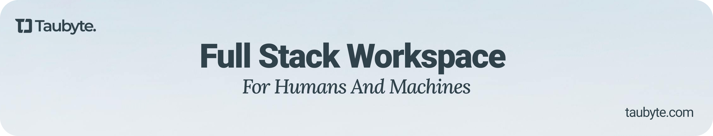

  
  
  

 
Tau is an open-source, Git-native platform-as-a-service for building, deploying, and scaling applications. Infrastructure is defined in Git, eliminating API calls. Fully self-hosted with capabilities similar to Vercel, Firebase, and Cloudflare, plus built-in AI features.
 
 
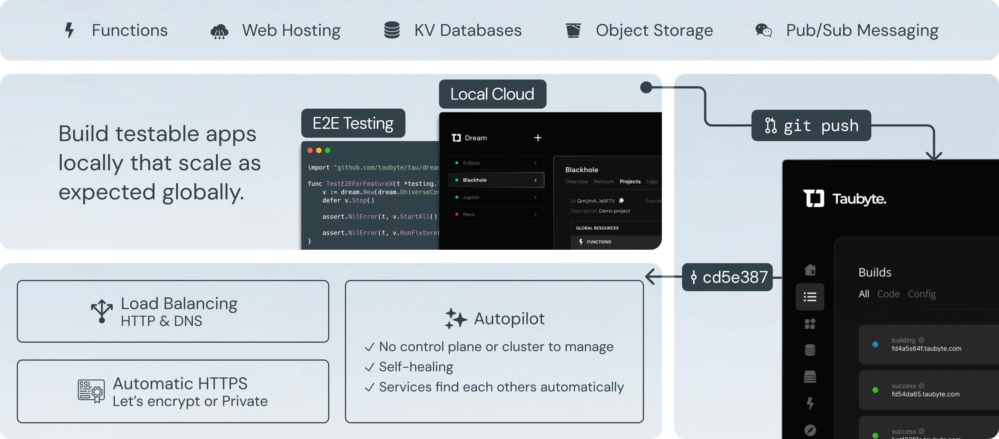

#### Development Environment

  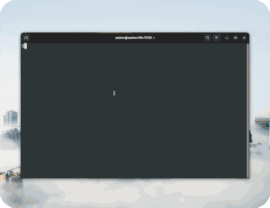
  
  
  
  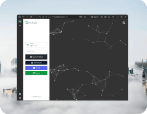

#### Build Your Application

  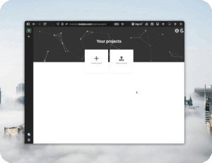
  
  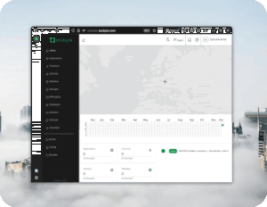
  
  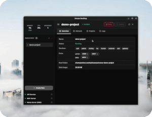

#### Deploy and Run

  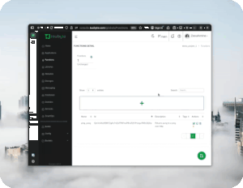
  
  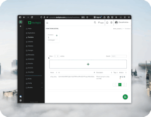
  
  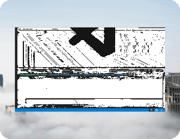

#### Example Projects

  
  <a href="https://youtu.be/gMTYh-gQLgA">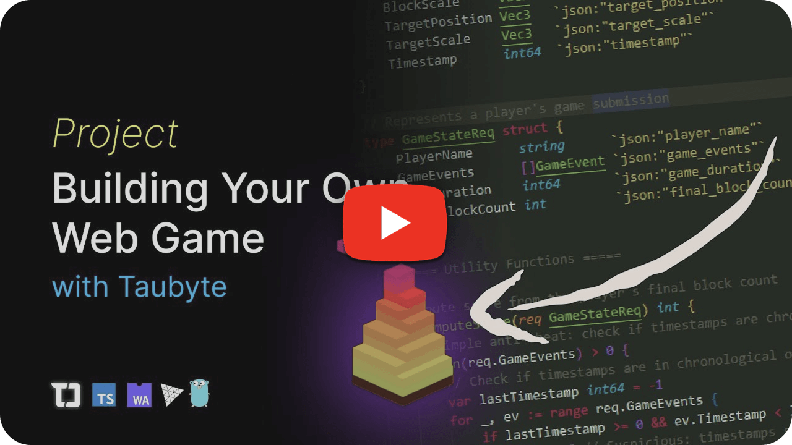</a>

## Quick Start
### Run Locally

The quickest way to try Taubyte is to spin up a local environment with dream → [https://tau.how/getting-started/local-cloud/](https://tau.how/getting-started/local-cloud/)

### Deploy

Deploy Taubyte to your own Servers and/or VMs:

* Manual deployment → [https://tau.how/platform/deployment/](https://tau.how/platform/deployment/)

* Automated deployment with Spore Drive → [https://tau.how/platform/spore-drive/](https://tau.how/platform/spore-drive/)

### Prefer Video?

Check out the **Hitchhiker's Guide to Taubyte** for guided walkthroughs and demos:

 

  <a href="https://www.youtube.com/watch?v=8FO1KiTE0FE">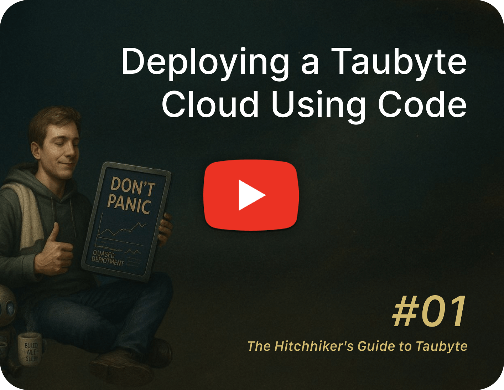</a>
  
  

  
  
  

 

## Staying ahead

Star us on GitHub and be instantly notified of new releases.

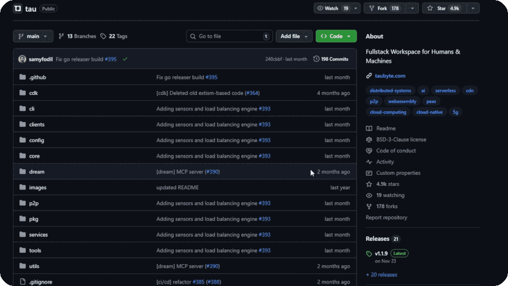

## Contributing

Tau thrives with your help. Fix bugs, add features, improve docs, or guide the community.

**How to contribute**
- Fork → branch from `main` → make changes → test → submit a PR
- Keep commits focused and describe what & why clearly
- New here? Look for `good first issue`

## License

BSD-3-Clause license. See [LICENSE](LICENSE) for details.

 

  
  &nbsp;
  
  &nbsp;
  
  &nbsp;
  

  Built by the Taubyte team

