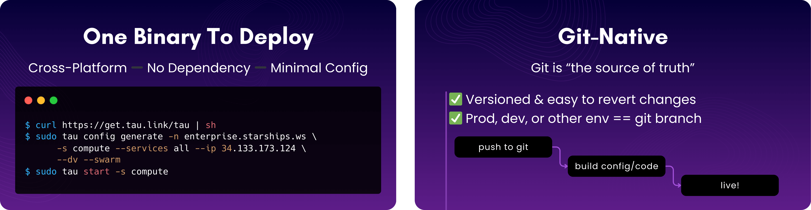
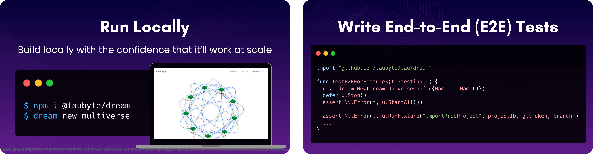
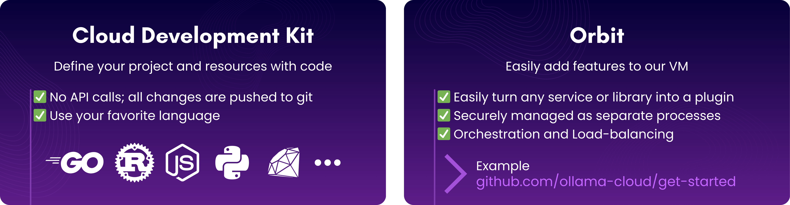
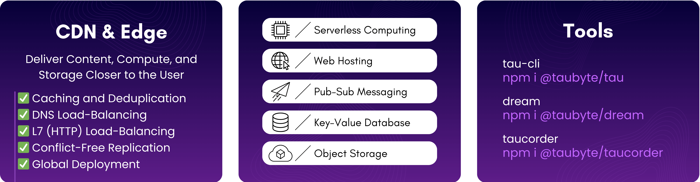

<div align="center">
  <a href="https://discord.gg/KbN3KN7kpQ">
    
  </a>
  <a href="https://tau.how">
    
  </a>
  <a href="https://console.taubyte.com">
    
  </a>
</div>

<br/>

<div align="center">
  <a href="https://taubyte.com" target="_blank" rel="noopener noreferrer">
    <picture>
      <source media="(prefers-color-scheme: dark)" srcset="images/logo-with-text-tau-white.png">
      
    </picture>
  </a>
  
  <br/>

  <div align="center">

[](https://github.com/taubyte/tau/releases)
[](LICENSE)

  </div>

  <strong>
  <h2>Open Source Git-Native CDN PaaS</h2>
  </strong>
</div>

<div align="center">
  <strong>
  An alternative to: Vercel, Netlify, Cloudflare, Amazon Lambda with CloudFront, S3, ElastiCache & SQS, Etc...
  </strong>
  <p align="center">
    <a href="https://tau.how"><strong>Explore the docs »</strong></a>
    <br/>
    <a href="https://taubyte.com/blog/be-competitive-in-few-minutes/">Quick Start Guide</a>
    ·
    <a href="https://console.taubyte.com">Try our Sandbox Cloud</a>
    ·
    <a href="https://discord.gg/KbN3KN7kpQ">Join Our Discord</a>
  </p>
  <div align="center">
    
    
    
    
  </div>
</div>

---

<br />

Tau is a framework for building low maintenance & highly scalable cloud computing platforms that software developers will love!

`tau` is a single binary with no external dependencies except standard system libraries. On top of that, it requires minimal configuration. These are the main steps:

1. **Install Tau**

   ```sh
   curl https://get.tau.link/tau | sh
   ```

2. **Configure**

   ```sh
   tau config generate -n yourdomain.com -s compute --services all --ip your_public_ip --dv --swarm
   ```

3. **Launch**
   ```sh
   tau start -s compute
   ```

For a complete step-by-step guide, refer to [Deploy tau](https://tau.how/01-getting-started/04-deploy-a-cloud/).

Building `tau` youself is a straightforward `go build` given you have Go installed.

## Background

The cost and time required to build software, take it from the development environment to production, and then scale it effectively to meet end-user demand are extremely high.

Developer-friendly platforms, like the major cloud computing providers, are expensive, lock users in, and overlook local development and E2E testing.

This is really a two-sided problem. Do you save on infrastructure cost, or do you lower development time?

If you invest in your own platform, it's a rocky road that impedes the speed of development and generally ends up costing more. We all know the Kubernetes fairy tale does not end well!

If you invest in development speed, you're limited by your provider's features and cost.

To us, solving this problem means:

- Giving you, or your very small team, the ability to build and maintain a cloud computing platform that will go head-to-head with the ones backed by thousands of engineers.
- Setting software developers free from infrastructure and operational constraints. We refer to this as "Local Coding Equals Global Production."

`tau` solves for building and maintaining a cloud computing platform, and also provides the foundations for an amazing developer experience.

## Minimal Configuration

One of the reasons `tau` requires minimal configuration is because it has built-in auto-discovery.
Just like a self-driving car gathering information through sensors, `tau` will gather information and try to find the best ways to be reachable, available, etc.

That said, some configuration like bootstrap peers is necessary. Unless you're running a single-node cloud, each node will need to know at least one other peer.

A Cloud built with `tau` is very dynamic; at a low level, nodes communicate assets, routes, and services, and they also exchange information about other peers. Enriched by distributed services like `seer` and `gateway`, the cloud can load-balance incoming requests to ensure optimal performance and reliability.

This behavior is built into cloud resources as well. For example, a service we call `hoarder` ensures object storages and databases are replicated; all you need to do is enable it on a few nodes.

## Local Coding Equals Global Production

In your traditional setup, the platform is a complex set of templates, pipelines, and integrations that ultimately help turn configuration into API calls and code into assets. Because of that complexity, and also the fact that many components need to run inside a very complex environment of their own, it's impossible to satisfy the 'local == production' equation.

Granted, there are some solutions that either mock or reroute to dev/prod resources, enabling developers to build or debug locally. However, it's still a 3rd party service you need to integrate and manage.

In order to satisfy the equation, we decided to build `tau` so it simplifies, ports, and/or sandboxes every aspect of the cloud.

## Git-Native

Traditionally, you interface with infrastructure through API calls. This is the case for every cloud computing provider alongside orchestration solutions like Kubernetes.

A few years back, the concept of GitOps started to make waves, and that was around the time we started building, so we decided to cut the unnecessary garbage between the definition of a cloud resource, which should be stored in Git, and its instantiation.

As a result, `tau` has no API calls to create a serverless function, for example. Instead, it adopts Git as the only way to alter infrastructure.

Also, git being core to `tau` means that nodes in the cloud do tune to a specific branch, by default main or master. Among what it enables is an easy way to set up development environments, for example.

A specific use case is local development in which case [dream-cli](https://github.com/taubyte/tau/tree/main/tools/dream) nodes can also be tuned to the current branch.

In addition to the nodes being on a branch, the application registry, managed by the 'tns' service, uses commit ids to version entries, allowing nodes serving the assets to detect new versions, or a roll-back for that matter.

## Networking

Internally, `tau`, using [libp2p](https://github.com/libp2p/go-libp2p), builds an overlay peer-to-peer network between the nodes, enabling some pretty cool features like:

- Automatic node and service discovery & routing. If, for example, a node is down, changes its IP address/port, or the services it supports, other nodes will update the info automatically.
- Transport independent. Nodes can use any combination of TCP/IP, WebSocket, QUIC, and more.
- NAT Traversal & Circuit Relay, which allow nodes that are not public to be part of the cloud.

Unless absolutely required, which is extremely rare, no well-designed software should rely on IP addresses and ports. This is why every `tau` cloud is identified with an FQDN (i.e., enterprise.starships.ws) so no absolute network reference is used in an application. Under the hood, the Cloud will transparently take care of DNS resolution and HTTP load balancing, eliminating the need to set these up.

## Storage

In every other cloud computing implementation, storage means a location and generally a path. For example, `https://tau.how/assets/logo-w.svg` has two main components `tau.how`, which translates to an IP address and a location, and `/assets/logo-w.svg`, which is a path relative to the location. This way of addressing, called "location-based addressing," is simply not portable. Why? you might ask. Well, for starters, nothing guarantees the data returned is an SVG logo in this case. The other issue is the `tau.how` host we connected to might not have it.

To solve this issue, `tau` uses content-addressing, a concept introduced by torrent networks and popularized by [IPFS]().

So when you request `https://tau.how/assets/logo-w.svg`, which is actually hosted by a `tau` Cloud, the host that handles the request will resolve (`host=tau.how, path=/assets/logo-w.svg`) to a content address, or CID, then retrieve the content reader and then forward it through an HTTP writer to you.

A few cool facts about this approach:

- Content is chunked and then stored in a DAG, which means it's deduplicated.
- Content can be downloaded from multiple peers in parallel.
- Content can be verified as the CID is its hash.
- When content is in demand, the cloud automatically dedicates more peers to its distribution.

## Computing

As of today, `tau` supports [WebAssembly](https://webassembly.org/) for computing. The reason we started with it is that it's highly portable and sandboxed. We support containers for CI/CD but not for computing yet. We're working on a way to implement containers and virtual machines while abiding by our principles of portability and sandboxing.

Code, binary, images, along with any attached assets, are stored and retrieved using the same principles described in [Storage](#storage), which considerably reduces provisioning time and brings computing close to data (data gravity) and/or user (edge computing).

## E2E Testing

If you're looking to create E2E tests for projects hosted on `tau`, you can use `dream`, a sub-package within `tau`. We don't have documentation for it yet, but you can quickly learn from tests like [services/seer/tests/dns_test.go](https://github.com/taubyte/tau/blob/main/services/seer/tests/dns_test.go#L35).

## Running a Local Cloud

While you can't practically run `tau` on your local machine, you can do so using [dream-cli](https://github.com/taubyte/tau/tree/main/tools/dream), which is a CLI wrapper around `dream`. It creates local cloud environments mirroring production settings. Unlike `tau`, it offers an API for real-time configuration and testing.

## Extending Tau

`tau` can be extended using a plugin system we call [orbit](https://github.com/taubyte/tau/tree/main/pkg/vm-orbit). An open-source example is [ollama-cloud](https://github.com/ollama-cloud), which demonstrates how to add LLM capabilities to your cloud.

## Documentation

To learn more, check:

- [Introduction to Taubyte](https://taubyte.com/blog/introduction-to-taubyte/)
- [Be Competitive in a Few Minutes: Deployment Guide](https://taubyte.com/blog/be-competitive-in-few-minutes/)

For comprehensive documentation, visit our [documentation](https://tau.how).

## Support

Questions or need assistance? Ping us on [Discord](https://discord.com/invite/KbN3KN7kpQ)!
