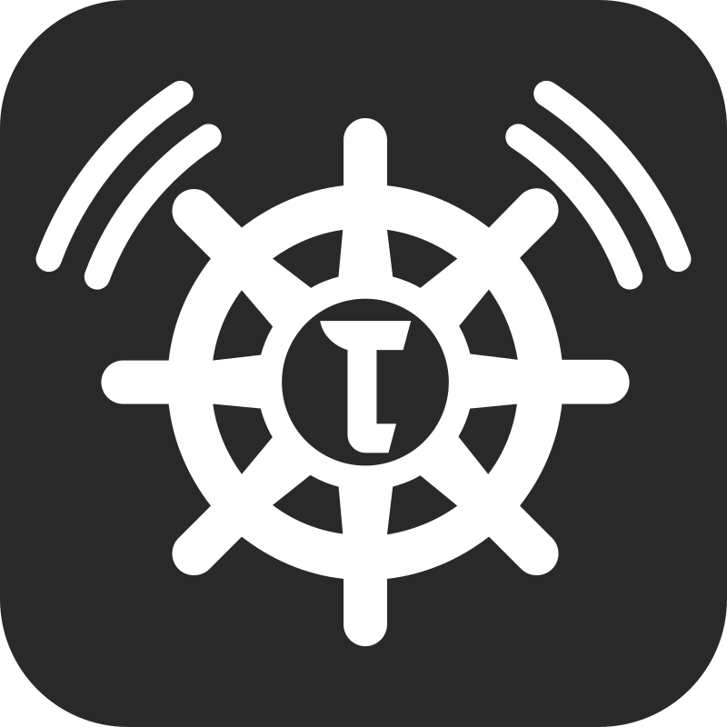
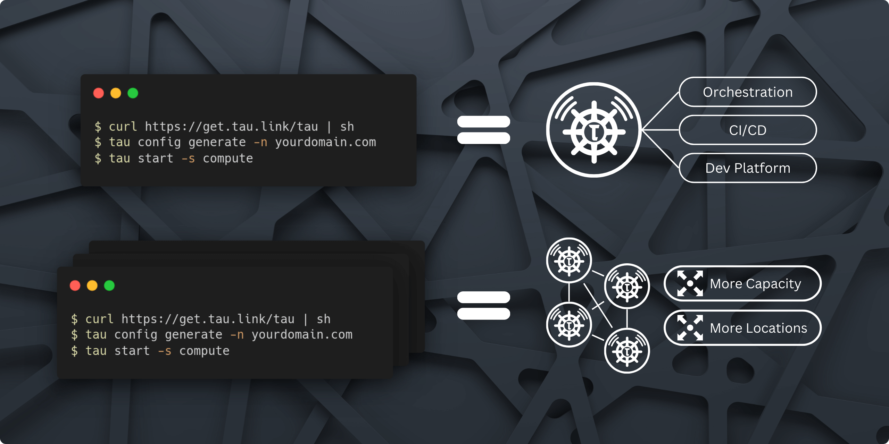

<h2 align="center">
  <a href="https://taubyte.com" target="_blank" rel="noopener noreferrer">
    <picture>
      <source media="(prefers-color-scheme: dark)" srcset="images/tau-logo-box-v2.png">
      
    </picture>
  </a>
  <br />
  Tau - Infrastructure's Autopilot
  
  ***Local Coding Equals Global Production***
</h2>
<div align="center">

[](https://github.com/taubyte/tau/releases)
[](LICENSE)
[](https://goreportcard.com/report/taubyte/tau)
[](https://pkg.go.dev/github.com/taubyte/tau)
[](https://discord.gg/wM8mdskh)

</div>

<br />


Tau, implentation of [Taubyte](https://github.com/taubyte), elevates cloud infrastructure to autonomous operation, seamlessly bridging local development and global production. Embrace the freedom of coding without boundaries, where your infrastructure intelligently adapts and scales on its own.



## 🚀 Quick Start
Deploy `tau` in three simple steps:

1. **Install Tau**
   ```sh
   curl https://get.tau.link/tau | sh
   ```

2. **Configure**
   ```sh
   tau config generate -n yourdomain.com -s compute --protos all --ip your_public_ip
   ```

3. **Launch**
   ```sh
   tau start -s compute
   ```

## 🧪 E2E Testing for Your Project

`libdream`, a sub-package within `tau`, is a powerful tool for creating end-to-end (E2E) unit tests for your projects. By simulating real-world cloud behavior in a controlled local environment, libdream enables comprehensive testing scenarios that mimic production environments. This ensures your applications perform reliably under real-world conditions before global deployment.

## 💡 Running a Local Cloud

Dreamland ([github.com/taubyte/dreamland](https://github.com/taubyte/dreamland)) is a CLI tool that creates local cloud environments mirroring production settings. It offers an API for real-time configuration and testing, powered by libdream. Dreamland ensures developers can simulate and interact with their applications in a production-like environment, streamlining the path from development to deployment.

## ✨ Core Principles of Tau

- **Embracing Best Practices:** `tau` integrates automation with DevOps, GitOps, and SRE best practices, ensuring projects are reliable, efficient, and secure.

- **Elevating Platform Engineering:** For platform engineers, `tau` provides tools and autonomy to customize and perfect the cloud environment, enhancing infrastructure effectively.

- **A Developer-Centric Experience:** `tau` prioritizes developers, ensuring seamless scalability from local development to global production.

- **Focus on Edge Computing & Distributed Systems:** `tau` leverages peer-to-peer network techniques for advanced edge computing and distributed systems, ensuring resilience and scalability.

## 📖 Dive Deeper

Learn more about Taubyte and its capabilities:
- [Introduction to Taubyte](https://taubyte.com/blog/introduction-to-taubyte/)
- [Be Competitive in a Few Minutes: Deployment Guide](https://taubyte.com/blog/be-competitive-in-few-minutes/)

For comprehensive documentation, visit our [documentation site](https://tau.how).

## 🌌 Expanding Possibilities

Explore Tau's capabilities with projects like [ollama-cloud](https://github.com/ollama-cloud), demonstrating how Tau's infrastructure supports advanced applications, from AI to beyond.

## 🔮 What's Next

Tau is continuously evolving, with plans to introduce JavaScript and Python support, container capabilities, and more. Your contributions are welcome to shape Tau's future.

## 📬 Support

Questions or need assistance? Our [Discord server](https://discord.gg/wM8mdskh) offers support and a community for discussion.