

 

  <a href="https://discord.gg/KbN3KN7kpQ">
    <picture>
      <source media="(prefers-color-scheme: dark)" srcset="images/new/joindiscord-dark.png">
      <source media="(prefers-color-scheme: light)" srcset="images/new/joindiscord-light.png">
      
    </picture>
  </a>
  &nbsp;&nbsp;
<a href="https://dub.sh/taubyte-docs">
    <picture>
      <source media="(prefers-color-scheme: dark)" srcset="images/new/documentation-dark.png">
      <source media="(prefers-color-scheme: light)" srcset="images/new/documentation-light.png">
      
    </picture>
  </a>

 

    
    
    
    

<table>
<tr>
<td align="center"><a href="https://youtu.be/qjLLmyWrGBM">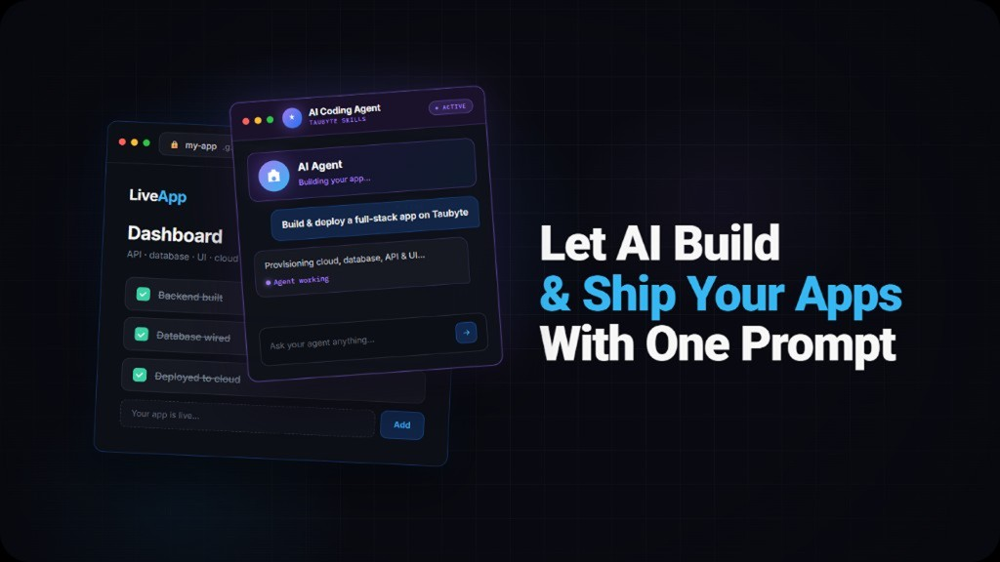</a></td>
<td align="center"><a href="https://youtu.be/0CjZhJuU7lQ">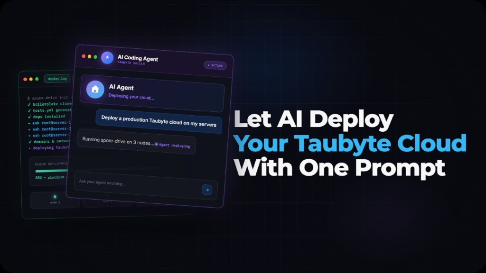</a></td>
</tr>
</table>

    
    

 
 

#### Development Environment

  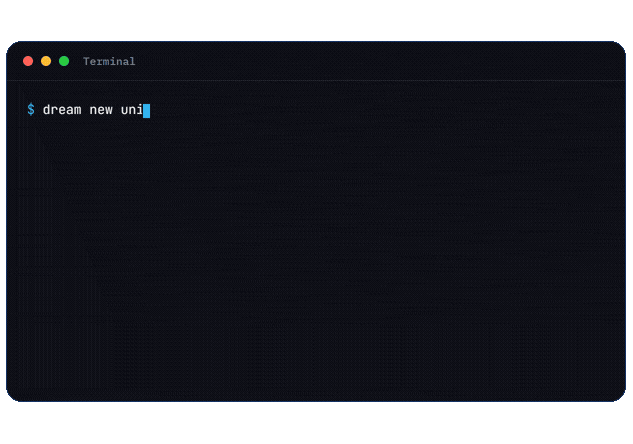
  
  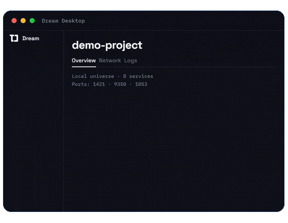
  
  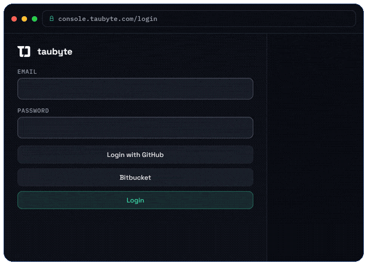

#### Build Your Application

  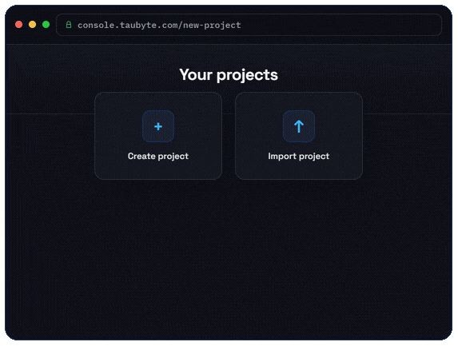
  
  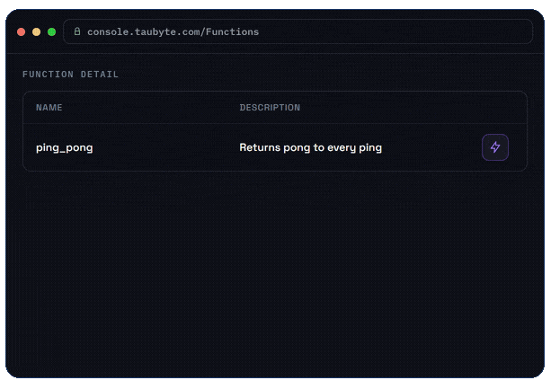
  
  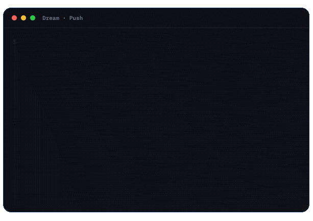

#### Deploy and Run

  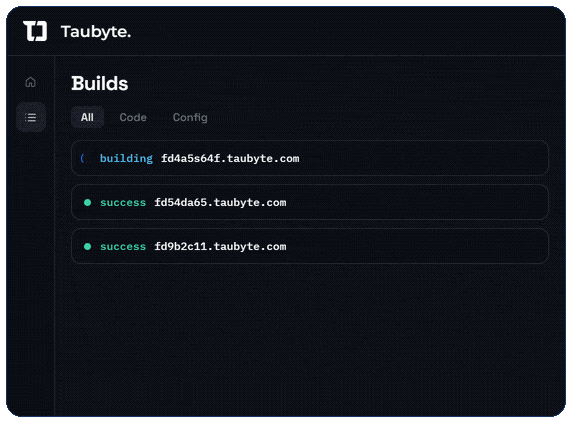
  
  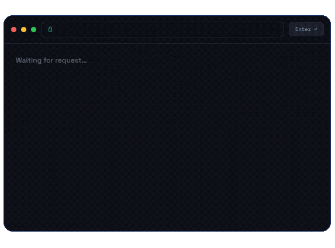
  
  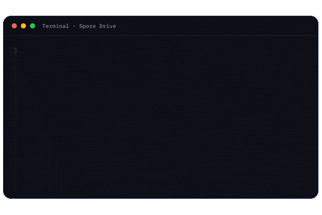

 
 

## Quick Start

### Run Locally

The quickest way to try Taubyte is to spin up a local environment with dream → [https://tau.how/getting-started/local-cloud](https://dub.sh/tau-local-cloud)

### Deploy

Deploy Taubyte to your own Servers and/or VMs:

* Manual deployment → [https://tau.how/platform/deployment](https://dub.sh/tau-deployment)
* Automated deployment with Spore Drive → [https://tau.how/platform/spore-drive](https://dub.sh/tau-spore-drive)

### Prefer Video?

Check out the **Hitchhiker's Guide to Taubyte** for guided walkthroughs and demos:

 

  <a href="https://dub.sh/vid1">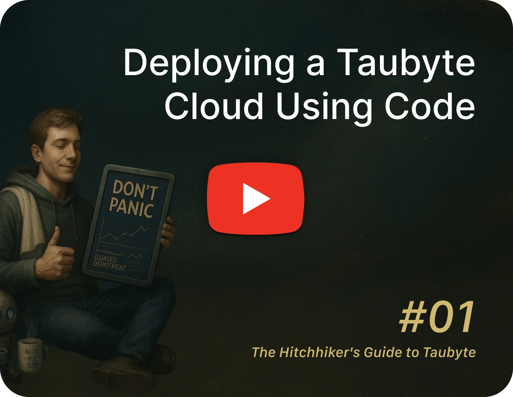</a>
  
  

  
  
  

 

## Staying ahead

Star us on GitHub and be instantly notified of new releases.

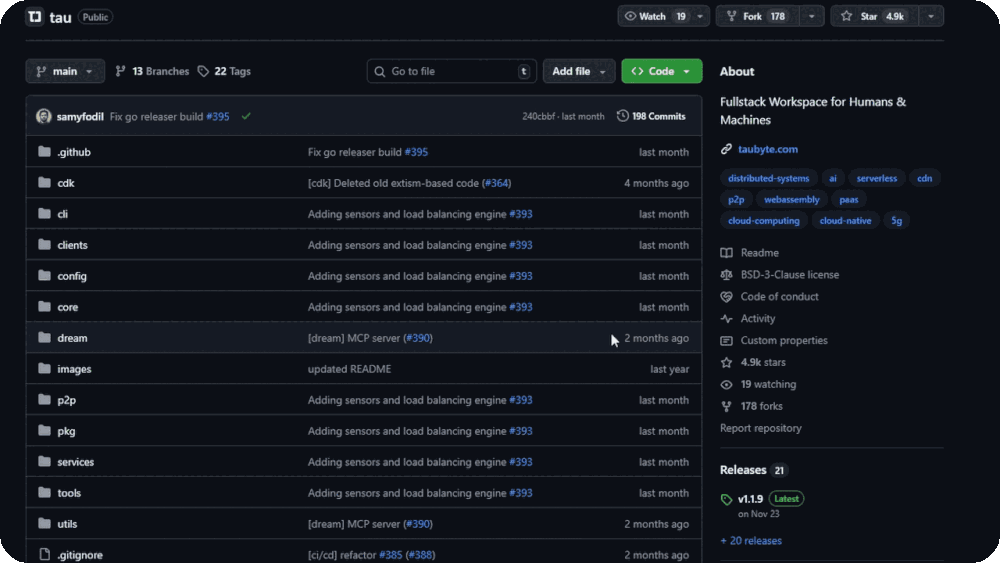

## Contributing

Tau thrives with your help. Fix bugs, add features, improve docs, or guide the community.

**How to contribute**
- Fork → branch from `main` → make changes → test → submit a PR
- Keep commits focused and describe what & why clearly
- New here? Look for `good first issue`

## License

BSD-3-Clause license. See [LICENSE](LICENSE) for details.
