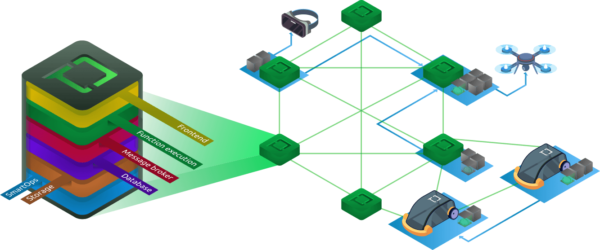

# tau

[](https://github.com/taubyte/tau/releases)
[](LICENSE)
[](https://goreportcard.com/report/taubyte/tau)
[](https://pkg.go.dev/github.com/taubyte/tau)
[](https://discord.gg/taubyte)

`tau` represents the core implementation of a Taubyte Node. Once interconnected, these nodes forge a robust network optimized for cloud computing, offering features like:

- 🚀 Serverless WebAssembly Functions
- 🌍 Website/Frontend Hosting
- 📦 Object Storage
- 🗂 K/V Database
- 📢 Pub-Sub Messaging



## Documentation

Dive deep into the nuances and specifics by exploring our [comprehensive documentation](https://tau.how).

## Local Testing

Keen on taking `tau` for a spin right on your laptop? Begin with [dreamland](https://github.com/taubyte/dreamland) for a seamless local testing experience.

## Getting started

### Requirements

#### Hardware
The requirements for `tau` vary depending on the shape, but at a minimum, assuming an empty shape, it requires:

- 512MB of RAM
- 2GB of storage space

#### Operating system
While `tau` can be cross-compiled to various operating systems, for a quick and seamless deployment we recommend using a Linux distribution that employs SystemD.


#### Network requirements
Depending on the enabled protocols, `tau` will require certain network ports to be available and open:

- Three configurable TCP ports for peer-to-peer (P2P) communication
- Ports 80 and 443 for HTTP and HTTPS respectively
- Ports 53 and 953 for DNS, supporting both TCP and UDP


#### Freeing DNS Ports
DNS needs to be freed up for seer protocol to start properly. Follow these steps to adjust DNS settings:

1. Open `/etc/systemd/resolved.conf` with a text editor (nano, vim)
2. Set `DNS=1.1.1.1` and `DNSStubListener=no`
3. Run `systemctl restart systemd-resolved.service`
4. Run `ln -sf /run/systemd/resolve/resolv.conf /etc/resolv.conf`


### Installation

#### From source
```bash
$ go install github.com/taubyte/tau
```

#### From binary
To download the latest release run:
```
$ curl https://get.tau.link/tau | sh
```

To install
```
$ curl https://get.tau.link/tau | sh -s -- -i
```

Other options:
 - `-O <path/to/download/folder>` if not specefied a temporrary folder is used
 - `-r <path/to/root>` by default `/tb`
 
### Filesystem Structure
We at Taubyte prioritize convention over configuration. Hence, we've pre-defined the filesystem structure and its location as follows:
```
/tb
├── bin
│   └── tau
├── cache
├── config
│   ├── <shape-1>.yaml
│   ├── <shape-2>.yaml
│   └── keys
│       ├── private.key
│       ├── public.pem
│       └── swarm.key
├── logs
├── plugins
└── storage
```

> Note: If you prefer a different location, use the --root option.

### Configuration
Configuration files for `tau` are located at `/tb/config/shape-name.yaml`. Here's an example:

```yaml
privatekey: CAESQJxQzCe/N/C8A5TIgrL9F0p5iG...KzYW9pygBCTJSuezIc6w/TT/unZKJ5mo=
swarmkey: keys/test_swarm.key
protocols: [patrick,substrate,tns,monkey,seer,auth]
p2p-listen: [/ip4/0.0.0.0/tcp/8100]
p2p-announce: [/ip4/127.0.0.1/tcp/8100]
ports:
  main: 8100
  lite: 8102
  ipfs: 8104
location:
  lat: 120
  long: 21
network-url: example.com
domains:
  key:
    private: keys/test.key
  services: ^[^.]+\.tau\.example\.com$
  generated: g\.example\.com$
```

### Running `tau`
Execute a `tau` node with:
```bash
tau start --shape shape-name
```
For an alternative root to `/tb`:
```bash
$ tau start --shape shape-name --root path-to-root
```

### Systemd Configuration
To ensure that `tau` runs as a service and starts automatically upon system boot, you can set it up as a `systemd` service. 

1. Create a new service file:
```bash
$ sudo nano /etc/systemd/system/tau.service
```

2. Add the following content to the file:
```plaintext
[Unit]
Description=Taubyte Node Service
After=network.target

[Service]
ExecStart=/path/to/tau/bin tau start --shape shape-name --root path-to-root
User=username
Restart=on-failure

[Install]
WantedBy=multi-user.target
```
Replace `/path/to/tau/bin` with the actual path to your `tau` binary and `username` with the name of the user running `tau`.

3. Enable and start the service:
```bash
$ sudo systemctl enable tau
$ sudo systemctl start tau
```

To check the status:
```bash
$ sudo systemctl status tau
```

This ensures `tau` runs consistently, even after system reboots.

### Setting up DNS for your network
Next, set up DNS records for your seer, generated domain, and service URLs, all with a 1-minute TTL.

### Seer
For each host running seer, add an `A Record`.   
Host: seer -> Value: 127.0.0.1     

### Generated URL
Point your generated domain to your seers by adding a `NS Record`.   
If `g.example.com` is your generated domain URL, the record would be:    
Host: `g` -> Value: `seer.example.com`

### Service URL
Add a `NS Record` which by default should be your URL prefixed with tau.   
This record will also point to your seers.   
For `example.com` the record will be: `tau` -> `seer.example.com`

### Connecting to the network
It may take a few minutes for the DNS to recognize your changes. The best way to check is to perform a dig on your network's seer fqdn Like so:
```bash
$ dig a seer.tau.example.com
```
> replace `example.com` with your respective domain.

Then, on a client machine:

#### tau-cli
1. Get the `tau` cli if you don't have it already. Check [github.com/taubyte/tau-cli](https://github.com/taubyte/tau-cli).
2. Run `tau login`
3. Then `tau select network`
4. Choose `Remote` then type your network's domain

#### Web console
1. Go to [Taubyte Web Console](https://console.taubyte.com) 
2. Fill in your email and select 'Custom' in the network selector
3. Enter the network's domain and hit the checkmark
4. Login